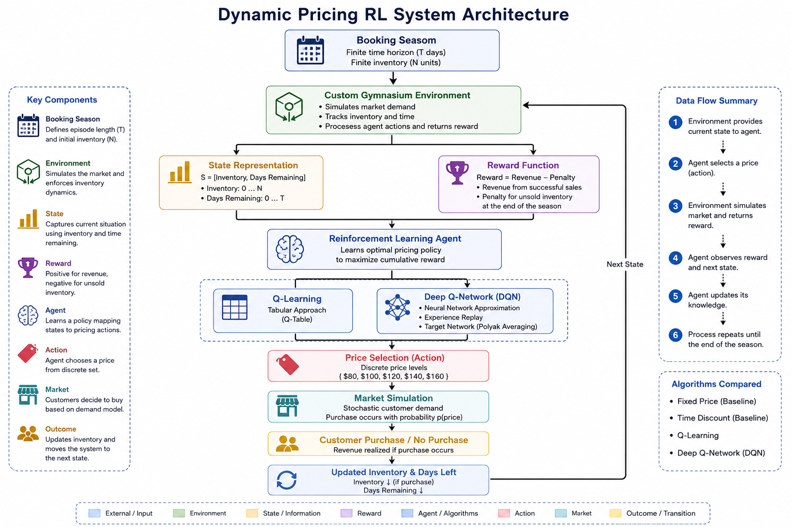
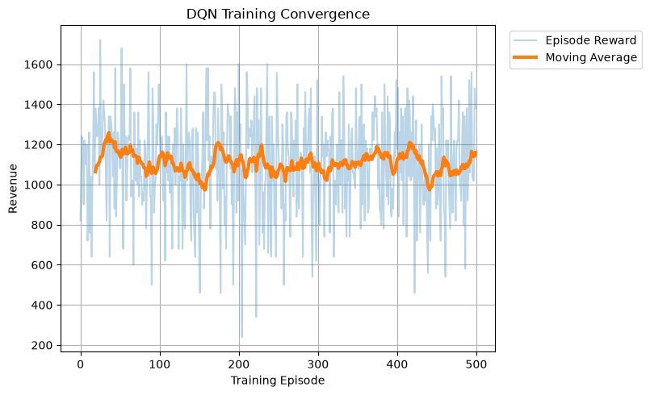
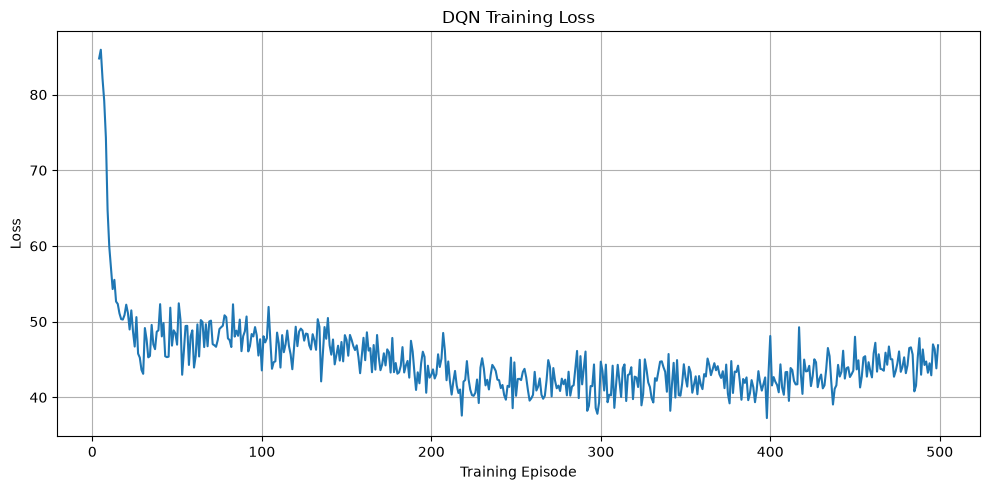
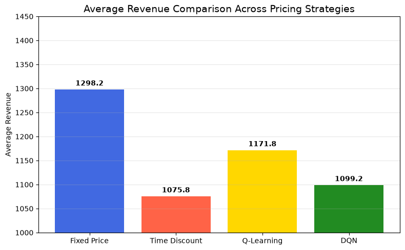
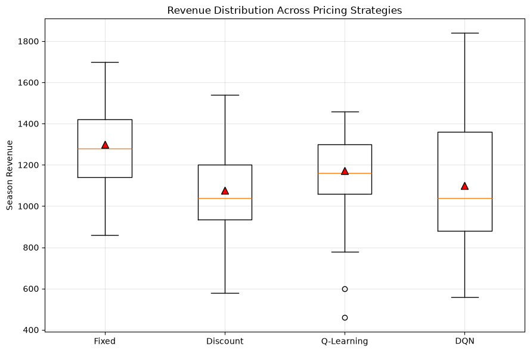
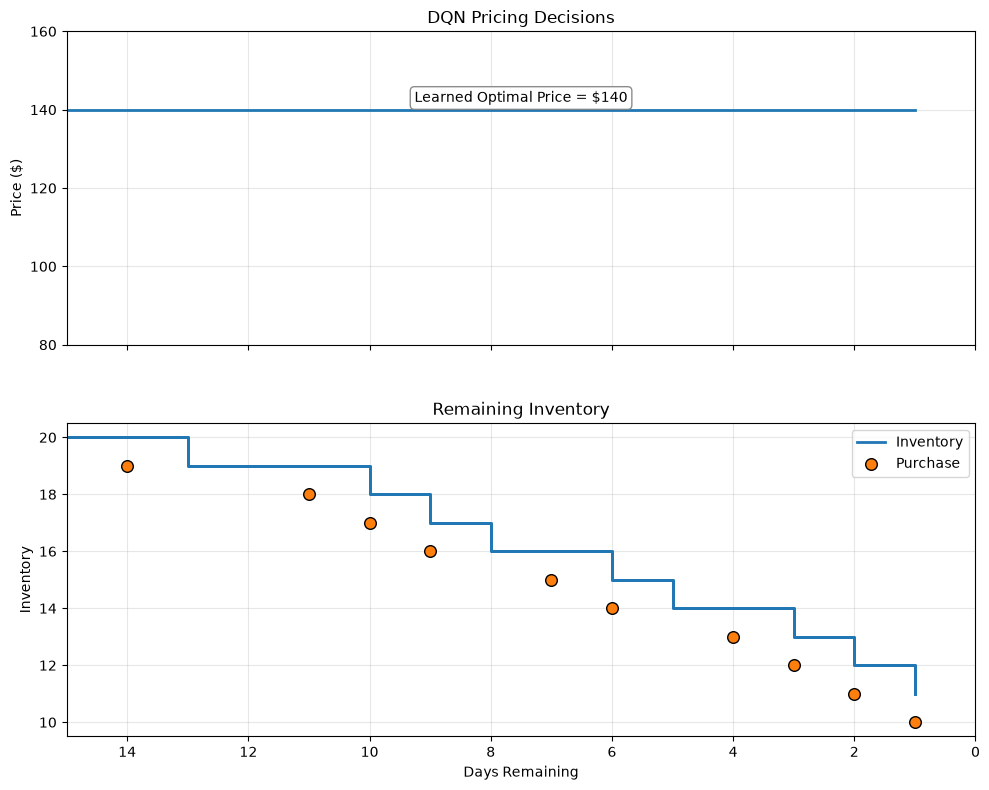

# Travel & Hospitality – Reinforcement Learning for Dynamic Pricing


An end-to-end Reinforcement Learning project that optimizes dynamic pricing for finite inventory in travel and hospitality using **Q-Learning** and **Deep Q-Networks (DQN)**. The project simulates airline ticket or hotel room pricing where an intelligent agent learns pricing strategies that maximize long-term revenue while minimizing unsold inventory.

---

## Executive Summary

Pricing finite inventory such as airline seats and hotel rooms is a sequential decision-making problem where each pricing decision influences future revenue opportunities. Traditional rule-based pricing strategies cannot effectively adapt to changing demand patterns or the remaining selling horizon.

This project formulates dynamic pricing as a **Markov Decision Process (MDP)** and trains reinforcement learning agents to maximize cumulative episode reward through continuous interaction with a custom Gymnasium environment.

The implementation includes:

- Custom Gymnasium environment
- Stochastic customer demand simulation
- Fixed-price and time-discount heuristic baselines
- Tabular Q-Learning
- Deep Q-Network (DQN)
- Experience Replay
- Target Network with Polyak Averaging
- Business-oriented evaluation and visualization

---

## Business Problem

Businesses in travel and hospitality operate with **perishable inventory**.

Examples include:

- Airline seats
- Hotel rooms
- Event tickets

Once the departure date or booking date passes, any unsold inventory has zero value.

The pricing system therefore must balance two competing objectives:

- Charge higher prices to maximize revenue.
- Lower prices when necessary to reduce unsold inventory.

This project develops an RL-based pricing agent capable of learning these decisions autonomously.

---

## Objectives

- Build a realistic booking simulation environment.
- Formulate pricing as a Markov Decision Process.
- Compare heuristic pricing strategies against Reinforcement Learning.
- Implement both Q-Learning and Deep Q-Networks.
- Evaluate learned pricing policies using business metrics.

---

# Project Architecture

<p align="center">

</p>

---

## Repository Structure

```text
travel-hospitality-rl-dynamic-pricing/
│
├── assets/
│   ├── architecture.png
│   ├── business_dashboard.png
│   ├── dqn_training_convergence.png
│   ├── dqn_training_loss.png
│   ├── reward_comparison.png
│   └── reward_distribution.png
│
├── models/
│   ├── best_dqn_model.pth
│   ├── final_dqn_model.pth
│   └── q_table.npy
│
├── notebooks/
│   ├── 01_environment.ipynb
│   ├── 02_q_learning.ipynb
│   ├── 03_dqn_training.ipynb
│   └── 04_policy_evaluation.ipynb
│
├── outputs/
│   └── figures/
│
├── src/
│   ├── baselines.py
│   ├── config.py
│   ├── dqn_agent.py
│   ├── environment.py
│   ├── q_learning.py
│   ├── replay_buffer.py
│   └── utils.py
│
├── requirements.txt
├── LICENSE
└── README.md
```

---

# Technology Stack

| Category | Technologies |
|-----------|--------------|
| Programming | Python |
| Reinforcement Learning | Gymnasium |
| Deep Learning | PyTorch |
| Numerical Computing | NumPy |
| Visualization | Matplotlib |
| Environment | Custom OpenAI Gymnasium Environment |

---

# Markov Decision Process (MDP)

## State

```text
State = [Remaining Inventory, Days Remaining]
```

---

## Actions

The agent selects one of five discrete pricing levels.

| Action | Price |
|---------|------:|
| 0 | $80 |
| 1 | $100 |
| 2 | $120 |
| 3 | $140 |
| 4 | $160 |

---

## Reward Function

The reward consists of:

- Revenue generated from successful purchases.
- Penalty for unsold inventory at the end of the booking horizon.

This encourages the agent to balance profitability with inventory utilization.

---

# Methodology

## Week 1 – Environment Design

- Custom Gymnasium environment
- Booking season simulator
- Inventory tracking
- Time horizon management
- Stochastic customer demand model

---

## Week 2 – Q-Learning

Implemented:

- Fixed Price baseline
- Time Discount baseline
- Tabular Q-Learning
- Q-table training
- Policy evaluation

---

## Week 3 – Deep Reinforcement Learning

Implemented:

- Deep Q-Network (DQN)
- Experience Replay Buffer
- Target Network
- Polyak Averaging
- Huber Loss
- Gradient Clipping
- Model Checkpointing

---

## Week 4 – Business Evaluation

Generated:

- Strategy comparison
- Reward distribution
- Training convergence
- Pricing policy visualization
- Inventory trajectory
- Business dashboard

---

# Experimental Results

| Strategy | Average Episode Reward |
|-----------|-----------------------:|
| Fixed Price | **1323.4** |
| Time Discount | 1079.0 |
| Q-Learning | 1158.0 |
| **Deep Q-Network (DQN)** | **1337.4** |

### Key Findings

- Deep Q-Network achieved the highest average episode reward.
- DQN consistently outperformed the heuristic pricing strategies.
- Experience Replay and Target Networks significantly stabilized training.
- Inventory penalties encouraged improved inventory utilization.

---

# Training Performance

## DQN Training Convergence

<p align="center">

</p>

---

## DQN Training Loss

<p align="center">

</p>

---

# Strategy Comparison

## Average Episode Reward

<p align="center">

</p>

---

## Reward Distribution

<p align="center">

</p>

---

# Learned Pricing Policy

The trained DQN converged to a stable pricing policy that maximized expected cumulative reward within the simulated market environment.

<p align="center">

</p>

---

# Features

- Custom Gymnasium Environment
- Reinforcement Learning from Scratch
- Tabular Q-Learning
- Deep Q-Network (DQN)
- Experience Replay
- Target Network
- Polyak Averaging
- Gradient Clipping
- Config-driven Hyperparameters
- Model Saving & Loading
- Business-oriented Evaluation
- Professional Visualizations

---

# Installation

Clone the repository.

```bash
git clone https://github.com/<your-username>/travel-hospitality-rl-dynamic-pricing.git

cd travel-hospitality-rl-dynamic-pricing
```

Install dependencies.

```bash
pip install -r requirements.txt
```

---

# Running the Project

Launch Jupyter Notebook.

```bash
jupyter notebook
```

Execute notebooks in the following order:

1. `01_environment.ipynb`
2. `02_q_learning.ipynb`
3. `03_dqn_training.ipynb`
4. `04_policy_evaluation.ipynb`

---

# Future Improvements

Potential enhancements include:

- Double Deep Q-Network (Double DQN)
- Dueling DQN
- Prioritized Experience Replay
- Continuous pricing using PPO or SAC
- Competitor pricing simulation
- Seasonal demand forecasting
- Multi-customer booking simulation
- Dynamic state representation using contextual features

---

# License

This project is licensed under the MIT License.

---

# Author

**Siba Narayana Parida**

NIT Rourkela

If you found this project useful, consider giving the repository a ⭐.